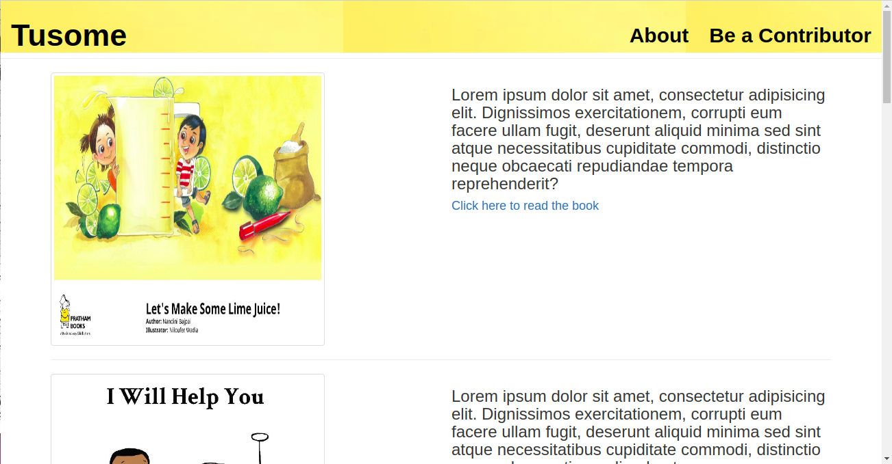

# TUSOME

 A children's books application that  displays various books mostly illustrated books for children under 10 to read. 

## Getting Started
* Clone this repository to your local computer and activate the virtual environment by entering  ```source              virtual/bin/activate``` from the terminal.

* Install all the dependencies by entering  ```pip install -r requirements.txt``` command in the terminal

* Ensure you have python3.6.4 and above installed in your computer.

* From the terminal navigate to the cloned project folder.

* Enter ``python manage.py runserver`` in the terminal to run the applcation

## Running the tests

To run the tests, run ``python manage.py test read``

### Prerequisites

The following are needed for the application to run on a local computer:
* python version 3.6
* Django 1.11 python web framework
* Bootstrap version 3.3.7
* Text editor or IDE
* Web browser

## Built With

* Django - The web framework used

## Authors

* **Mary Mbugua** 


## License

This project is licensed under the MIT License 

## Acknowledgments

* Moringa school community
### Layout
